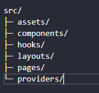
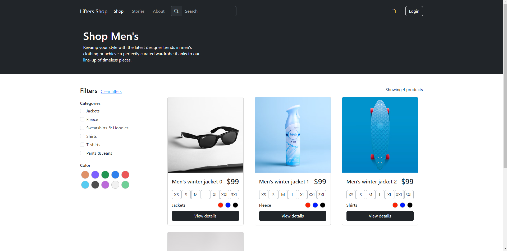
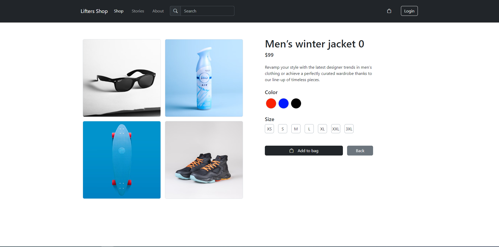

# E-Commerce Frontend Challenge - Lifters

## Introdução

Este repositório contém a solução para o desafio técnico proposto pela Lifters para a posição de desenvolvedor frontend. O desafio consistiu em desenvolver um frontend de e-commerce como uma Single Page Application (SPA), utilizando HTML, CSS, JavaScript, ReactJS e Bootstrap, com a adição do Vite.js para melhoria na construção e desenvolvimento do projeto.

## Tecnologias Utilizadas

- HTML
- CSS
- JavaScript
- ReactJS
- Bootstrap
- Vite.js

## Estrutura do Projeto

A estrutura de pastas do projeto foi projetada para facilitar a manutenção e a escalabilidade:



- **Assets**: Contém arquivos estáticos como imagens e estilos globais.
- **Components**: Contém componentes React reutilizáveis.
- **Hooks**: Armazena hooks personalizados do React.
- **Layouts**: Define layouts comuns usados em várias páginas.
- **Pages**: Contém os componentes de página da aplicação.
- **Providers**: Inclui contextos do React e outros provedores de estado.

## Como Rodar a Aplicação

Siga os passos abaixo para rodar a aplicação localmente:

1. Clone este repositório:

```bash
git clone https://github.com/RaimundooNeto/LiftersShop.git
```
2. Navegue ate a pasta do diretorio clonado:

```bash
cd LiftersShop
```

3. Instale as dependências do projeto:

```bash
npm install
```

4. Execute a aplicação no ambiente local:

```bash
npm run dev
```

5. Acesse http://localhost:5173 no seu navegador para ver a aplicação rodando.

## Funcionalidades
- Listagem de produtos com informações detalhadas.
- Visualização detalhada do produto com galeria de imagens.
- Carrinho de compras interativo com atualização dinâmica. (pendente)
- Simulação de checkout com validação de dados do cartão de crédito. (pendente)

## Capturas de Tela

### Página Inicial


### Detalhes do Produto

